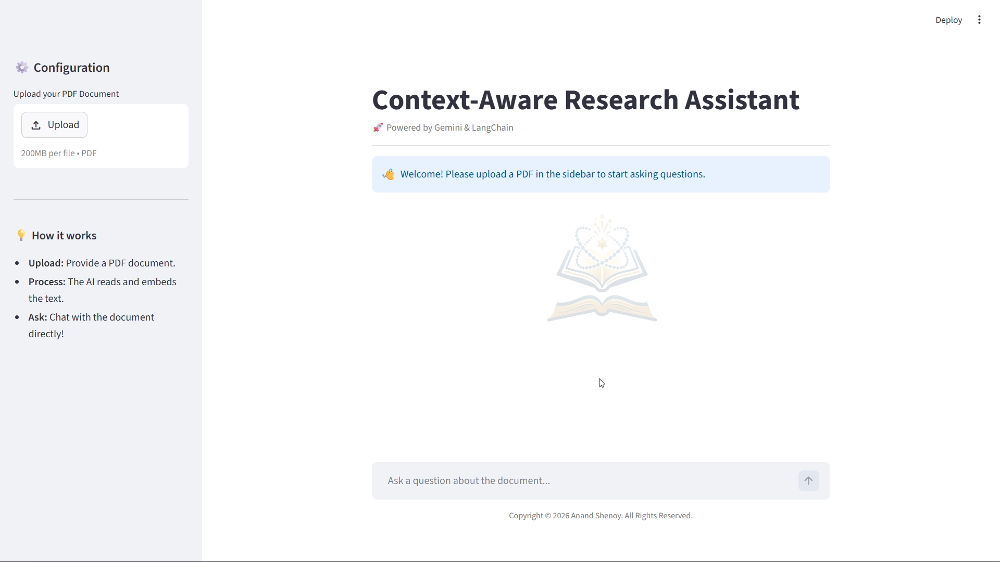

# 📚 Context-Aware Research Assistant

An AI Agent-powered Retrieval-Augmented Generation (RAG) web application designed to help users safely extract accurate information from dense, proprietary documents without the risk of AI hallucinations. It features intelligent tool routing, local vector database storage, and a live web search fallback.

## 📖 Overview

Standard LLMs often struggle with proprietary or dense academic documents, frequently leading to "hallucinated" answers when they lack native access to private files. Furthermore, these static models are inherently limited by their inability to access real-time, up-to-the-minute information. 

This project bridges that gap by deploying an AI Agent that processes uploaded PDFs into a local vector database for precise, factual extraction. As an intelligent query router, the agent then seamlessly pivots to a live web search whenever a question requires external or real-time context.

## ✨ Key Features

* **AI Agent Tool Routing:** Powered by LangChain, the core AI agent acts as a smart router, intelligently evaluating user prompts to decide whether to trigger the `Academic_Database` tool or the `Web_Search` tool.
* **Intelligent Document Chat:** Automatically parses, chunks (1000 characters with 200 overlap), and embeds uploaded PDFs into a local Chroma Vector Database for highly accurate semantic retrieval.
* **Hallucination Mitigation:** Engineered system prompts restrict the LLM to rely *strictly* on retrieved context or web results, forcing the agent to explicitly cite which source it used for transparency.
* **Live Web Fallback:** Integrates DuckDuckGo search to fetch real-time information when user queries fall outside the scope of the uploaded document (e.g., current medical treatments or recent news).
* **Interactive UI:** Features a clean, user-friendly chat interface built with Streamlit, complete with a sidebar for document uploads and persistent session memory for continuous conversation.

## 🛠️ Technologies

* **Frontend / GUI:** Streamlit
* **Backend:** Python
* **AI Orchestration Framework:** LangChain
* **AI Integration:** Google Gemini API (`gemini-2.5-flash` & `GoogleGenerativeAIEmbeddings`)
* **Database:** ChromaDB (Local Vector Store)
* **External Tools:** DuckDuckGo Search API (`DuckDuckGoSearchRun`)
* **Document Processing:** `PyPDFLoader`, `RecursiveCharacterTextSplitter`

## 📝 Prerequisites

To run this project locally, ensure that you have the following installed and configured on your machine:

* Python 3.8+
* VS Code (or your preferred Python IDE)
* A virtual environment (recommended)
* Required Python libraries (`python-dotenv`, `streamlit`, `pypdf`, `duckduckgo-search`, `langchain-google-genai`, `langchain` and other LangChain libraries)
* An active Google Gemini API Key (stored securely in a `.env` file as `GOOGLE_API_KEY`)

## 🎥 Project Demonstration

Click to watch the demo!

  

